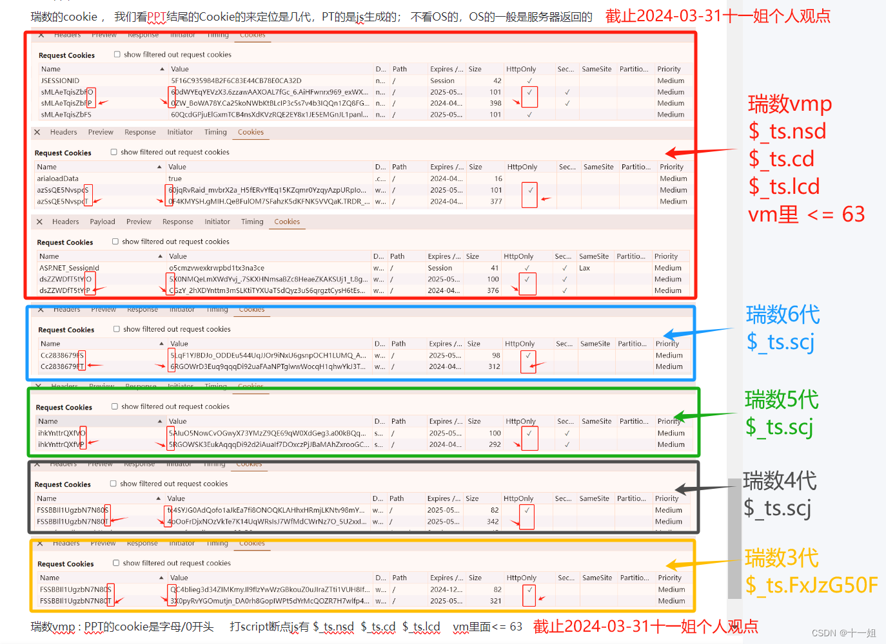
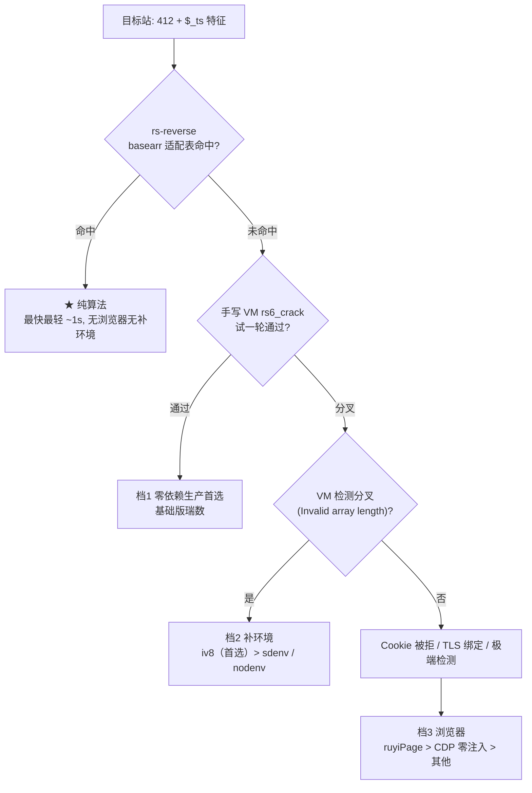
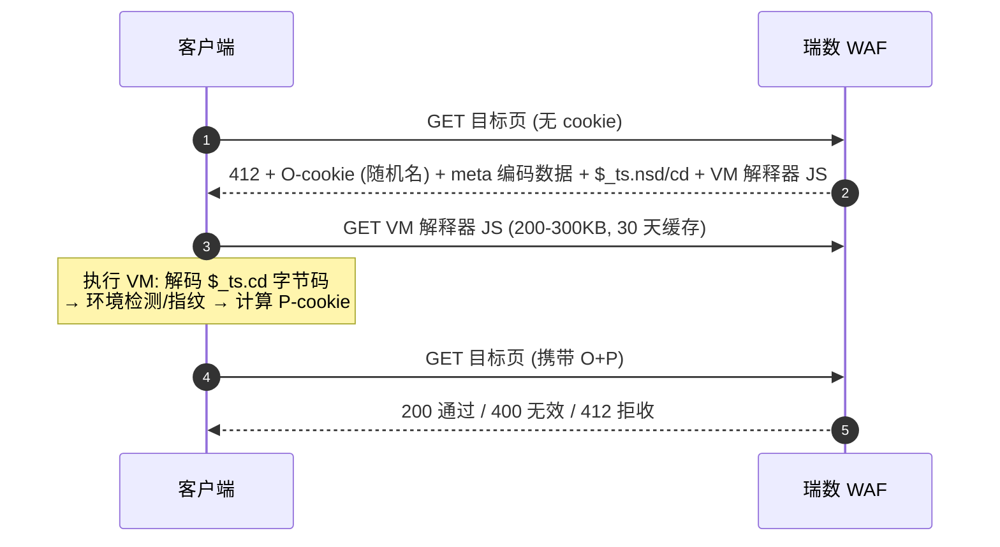

# 瑞数 WAF 逆向方案集 — 总索引

[](LICENSE)
[]()
[]()
[]()

**9 个真实瑞数站点 · 25+ 条技术路线 · 覆盖纯算法 / 补环境 / 浏览器三大技术族**，
每条路线都是「能请求到数据的最小可行代码」，含实测数据与避坑记录，可直接对照落地。

## 目录

- [站点案例](#站点案例)
- [路线 × 站点速查矩阵](#路线--站点速查矩阵)
- [快速启动](#快速启动)
- [瑞数产品与防护机制](#瑞数产品与防护机制)
- [瑞数版本分类速查](#瑞数版本分类速查)
- [三档方案决策表](#三档方案决策表)
- [iv8 运行时路线 · 致谢](#-iv8-运行时路线--致谢2026-09-05-全库-13-站打通)
- [选型决策流程](#选型决策流程)
- [关键认知](#关键认知)
- [常见问题](#常见问题)
- [开源策略](#开源策略)
- [整理指引](#整理指引)
- [License](#license)

## 站点案例

| 目录 | 站点 | 瑞数版本 | 状态 | 可行方案 |
|------|------|---------|------|---------|
| [site_e_enhanced](site_e_enhanced/)（站点E） | 中国信息通信研究院 | **6 代·加强检测** | ✅ 活跃（2026-08-19 实测 200） | **jsdom 同步 flush**（421 chars 秒出）/ sdenv / CloakBrowser |
| [site_b_standard](site_b_standard/)（站点B） | 国家电网招聘网 | 6 代·len127 | ✅ 活跃 | **rs-reverse 纯算法**（1.06s，200 验证）🔒 |
| [site_c_v67](site_c_v67/)（站点C） | 深圳大学总医院 | **v6/v7** | ✅ | sdenv / DrissionPage / CDP 零注入 / Camoufox |
| [site_a_base](site_a_base/)（站点A） | 5 所大学高校（逐一展示见下） | **6 代·2026 变体 ×4 + 5 代 ×1（南理工）** | ✅ 2026-09-02 五校复测 | sdenv / **nodenv 零依赖手写补环境** / env_scu·env_njust 锁定模板 / CDP / ruyiPage / Camoufox / DrissionPage / **rs-reverse 纯算法 2026 变体 🔒**（兰州+南师+北邮 200，2026-09-05，见 [pure_algo](site_a_base/pure_algo/)） |
| [site_d_debugger](site_d_debugger/)（站点D） | 药监局 | **6 代·debugger 变体**（hasDebug hd 位 0x80） | ✅ | sdenv 链式 / CDP / rs-reverse 纯算法 🔒 / 手写补环境 v3 / 手写 harness / **RPC pajax 数据层**（0.2s/页） |
| [tax_ruishu](tax_ruishu/)（站点F） | 税务局（TLS 指纹双变体版） | **6 代·TLS 双变体** | ✅ | **rs-reverse 纯算法 len173 自制适配器 🔒**（7/7 轮 200，~1s）/ 手写补环境 v3（5/5）/ **sdenv jsdom**（2/2，~17s） |
| [patent_cnipa](patent_cnipa/)（站点G） | 专利局双站（检索 + 公布公告，同族 WAF） | **6 代·412/202 双形态** | ✅ 2026-09-01 三路线 200 | **sdenv 链式**（10-20s）/ **nodenv 零依赖手写补环境**（13.2-13.8s，9/9）/ **CDP RPC** 生产爬虫；**公布公告站 rs-reverse 纯算法 200 🔒**（2026-09-03，~1s）；另 2 条不可行路线归档（handpatch / 检索站 rs-reverse）——完整路线全景见子目录 [README](patent_cnipa/README.md) |
| [site_h_cqvip](site_h_cqvip/)（站点H） | 维普期刊（qikan 期刊服务平台） | **6 代·classic** | ✅ 2026-09-05 三路线 200 | **sdenv 链式**（~7-11.5s）/ **nodenv 零依赖手写补环境**（~14s）/ **纯算法 v11 🔒**（realDf 加密链+nodenv 取钥 ~18s，密码体系全破译）——与站点G同族，补环境模板改 URL 即过 |
| [site_i_customs](site_i_customs/)（站点I） | 海关信用系统 | **6 代·http 变体** | ✅ 2026-09-05 iv8 翻盘 200 | iv8 路线最有价值站点：逼出两大通用坑（http+Secure 丢弃 / 复用 JSContext 污染），修复后 1.0s 200，经验已沉淀 `iv8_kit/` |

> 目录使用代号（site_A~I）；真实站点映射与明文 URL 见 `sites_mapping.local.md`（本地维护，不入库）。仓库内 URL 一律 base64 编码存储，运行时解码。

### 站点A · 五所大学高校（逐一展示）

文件统一存放于 [site_a_base](site_a_base/)（技术类型分类整理），五校各自的成功路线如下：

| 高校 | 官网 (base64) | 瑞数版本 | 成功技术路线（2026-09-02 复测） |
|------|--------------|---------|-------------------------------|
| 兰州大学（985） | `aHR0cHM6Ly93d3cubHp1LmVkdS5jbg==` | 6 代·2026 变体 | **nodenv 零依赖手写补环境 5/5**（14.0-14.4s，P=335c）· **rs-reverse 纯算法 200 🔒（2026-09-05）** · sdenv 13-15s · CDP/ruyiPage |
| 四川大学（985） | `aHR0cHM6Ly93d3cuc2N1LmVkdS5jbg==` | 6 代·202 变体 | **env_scu 锁定模板 3/3**（P=279c，runner 框架）· sdenv · CDP/ruyiPage |
| 北京邮电大学（211） | `aHR0cHM6Ly93d3cuYnVwdC5lZHUuY24=` | 6 代·2026 变体 | **nodenv 零依赖手写补环境 5/5**（13.4-13.6s，T=250c）· **rs-reverse 纯算法 200 🔒（2026-09-05）** · sdenv · CDP/ruyiPage |
| 南京师范大学（211） | `aHR0cHM6Ly93d3cubmpudS5lZHUuY24=` | 6 代·2026 变体 | **nodenv 零依赖手写补环境 5/5**（13.7-14.3s，T=250c）· **rs-reverse 纯算法 200 🔒（2026-09-05）** · sdenv · CDP/ruyiPage |
| 南京理工大学（211） | `aHR0cHM6Ly93d3cubmp1c3QuZWR1LmNu` | **5 代**（2026-09-05 实锤） | **env_njust 锁定模板 3/3**（P=173c，meta-embedded 特殊形态）· sdenv · CDP/ruyiPage |

> 解码：`echo <b64> | base64 -d`（bash）/ `[Convert]::FromBase64String("<b64>")`（PowerShell）。
> 五校中 lzu/bupt/njnu 已统一到 nodenv 零依赖方案；scu/njust 因形态差异保留独立锁定模板（详见 [site_a_base/README.md](site_a_base/README.md)）。
> 纯算法（2026 变体）2026-09-05 打通兰州+南师+北邮：密码链全还原（真字母表在 cp0、cd 同表解码、内层无 XOR），从零生成 P 回放 200；basearr 暂由同轮 nodenv 提供——详见 [pure_algo](site_a_base/pure_algo/)。

## 路线 × 站点速查矩阵

一眼看全「哪条路线在哪站跑通」——✅ 实测 200 · ⚡ 该站最快 · ❌ 已证不可行 · — 未实施：

| 路线 \ 站点 | A 高校组 | B 招聘 | C 医院 | D 药监 | E 研究院 | F 税务 | G 专利局 | H 维普期刊 | I 海关 |
|---|---|---|---|---|---|---|---|---|---|
| **rs-reverse 纯算法** 🔒 | ⚠️ 兰州✅·南师✅·北邮✅（2026 变体，见 [pure_algo](site_a_base/pure_algo/)） | ✅ ⚡ 1.1s | — | ✅ ⚡ 1-4s | ❌ | ✅ ⚡ ~1s | ⚠️ 检索站❌·epub✅ | ❌ codemap env 缺失 | — |
| **sdenv / jsdom 补环境** | ✅ | ✅ | ✅ | ✅ | ✅ | ✅ | ✅ | ✅ ⚡ 7-11.5s | — |
| **jsdom 同步 flush**（提速变体） | — | — | — | — | ✅ ⚡ 421c | — | — | — | — |
| **iv8 运行时**（pip C++ 环境） | ✅ 5/5 校 1-3.6s | ✅ ⚡ 1.0s | ✅ 1-4.3s | ✅ ⚡ 0.65s | ✅ 1.6s | ✅ 天津/重庆 1.2s | ✅ 双站 1.1-2.0s | ✅ ⚡ 1.6s | ✅ 1.0s（翻盘） |
| **手写补环境**（零依赖） | ✅ 3/5 校 | — | ✅ 20/20 | ✅ 10/10 | ❌ | ✅ 5/5 | ✅ 9/9 | ✅ 2/2 | — |
| **CDP / RPC**（真实 Chrome） | ✅ | — | ✅ | ✅ ⚡ 0.2s RPC | — | — | ✅ RPC 生产 | — | — |
| **反检测浏览器**（ruyiPage 等） | ✅ | ✅ | ✅ | — | ✅ | — | — | — | — |

> 每格的具体文件、实测耗时与避坑，见上表站点链接的对应子目录 README。

## 快速启动

### 税务局（站点F，三路线）

```bash
cd tax_ruishu/

# ★ sdenv 补环境（jsdom，2026-08-19 新通）：curl_cffi 抓 412 → node 生成 P cookie → 验证 200
pip install curl_cffi && python spider_sdenv_tj.py --rounds=3

# 手写补环境（零 npm 依赖）：同上链路，Node v3 模板
python spider_manual_env.py

# 纯算法 🔒 代码不开源（技术记录见 tax_ruishu/README.md 第三节）
# npm install rs-reverse && python patch_rs_reverse_tj.py && python spider_rs_pure.py
```

### 专利局双站（站点G）

```bash
cd patent_cnipa/
pip install curl_cffi

# 检索站 — sdenv 链式（npm sdenv）
python spider_sdenv.py

# 检索站 — nodenv 零依赖手写补环境（无需 npm install）
python spider_nodenv.py

# 公布公告站 — 生产爬虫（CDP RPC，免登录全量可爬）
cd epub && python rpc_spider.py 石墨烯 --max-pages 100
```

### 药监局（站点D）

```bash
cd site_d_debugger/
pip install curl_cffi websocket-client

# 数据采集首选 — RPC 直达 pajax（0.2s/页，签名免逆向）
python spider_rpc.py 阿莫西林 --max-pages 3

# 最快补环境 — iv8 运行时（pip 环境，0.65s 出 cookie）
pip install iv8 && python spider_iv8.py --kw 阿莫西林

# 页面验证 — sdenv 链式（npm sdenv）或 CDP 零注入
python spider_sdenv_chain.py
```

## 瑞数产品与防护机制

**瑞数（RiverSecurity）** 是国产 Web 应用动态安全厂商，主打「**动态安全**」理念：与传统 WAF 的
静态规则库/特征匹配不同，它的核心是**每次请求动态下发一次性混淆 JS**，必须由浏览器真实执行、
生成有效令牌后才放行——静态分析、常规爬虫、无头浏览器都被卡在这一步。

一个有趣的旁证：**瑞数官网自身就运行在自家防护下**——不带 cookie 用 curl 直连其官网首页，
返回的正是 412 挑战页（本仓库整理时实测）。产品展示与防护目标高度一致。

### 核心机制（以下全部为本仓库实战观察总结）

**① 动态令牌（O/P 双 cookie）**

- **O cookie**：服务器端下发（`Set-Cookie`，HttpOnly，名字每轮随机）
- **P cookie**：浏览器执行挑战 JS 后由 JS 写入（`document.cookie`，名字每轮随机）
- 服务端校验 **O+P 同轮配对** + 内部密码学结构 + 新鲜度（r2mkaTime 必须接近当前时间戳）；
  仅"长度形似"的伪造 cookie 一律 400

**② 动态混淆 + JSVMP 字节码**

- 412 页内嵌 `$_ts` 对象（`nsd`/`cd`/`scj`/`lcd`…），其中 `$_ts.cd` 即加密字节码
- 外链 VM 解释器 JS（约 200-300KB），**文件名与内容每轮都变**——所有"固定 hook 某函数"的思路失效
- 字节码的块布局/字段结构可静态定位（如 basearr 173 值、len 前缀体系），内容逐轮随机

**③ 环境检测与指纹**

- 静态：浏览器环境深层结构（eval direct 语义 / 函数 realm / DOM 集合类型 / navigator 键集）
- 动态：定时器节奏、行为序列；部分站点叠加 **TLS 指纹（JA3）** 分发不同挑战变体
- 检测分叉的典型惩罚：`Invalid array length`（字符串表解码出无效索引 → 循环 push 至 V8 上限）

**④ 密码学体系（纯算法路线的逆向结论）**

- 外层：**Feistel-CBC**，uuid = CRC32 校验解密正确性
- 内层：**AES 变体**（非 Feistel）+ 自定义 base64 + Huffman 编码 + 时间戳参与
- 站点差异集中在 **basearr 适配器**（不同站点不同值，len103~173），这是纯算法路线的核心工作

**⑤ 挑战响应码语义**

| 状态码 | 含义 | 处置 |
|--------|------|------|
| **202 / 412** | 挑战页（首次无 cookie，或 cookie 失效） | 执行挑战 JS 生成 P |
| **400** | cookie 结构被识别但字段无效——**比 412 更接近成功** | 对比环境/字段差异 |
| **200** | 通过 | ✅ |
| 空 404 + `wzws-ray` 头 | 多为 WAF 临时限流（491），**不是换 WAF** | 等 30 分钟-数小时 |

> 版本代际（3/4/5/6 代 + VMP）识别方法见下一节速查表——注意「同一代 ≠ 同一套方案」，
> 子形态差异（加强检测 / debugger 变体 / TLS 双变体 / 202 挑战 / meta-embedded）同样关键。

## 瑞数版本分类速查

遇到 202/412 挑战页，先看 **P 结尾的 cookie**（`PPT` 三段式中的 PT 段，JS 生成；O 段是服务器下发、不参与版本判断）的**开头字符**定位代际，再回上面的矩阵选路线：

| 版本 | PPT cookie 开头 | `$_ts` 特征 | 本仓库站点 |
|------|----------------|-------------|-----------|
| 瑞数 VMP | 字母 / 0 | `$_ts.nsd` + `$_ts.cd` + `$_ts.lcd` | — |
| **瑞数 6 代** | 6 | `$_ts.scj = []` | **除南理工外的全部站点（含各子形态）** |
| 瑞数 5 代 | 5 | `$_ts.scj = []` | **南京理工大学**（P=173c 开头 '5'、138KB VM、202+S+T 形态，2026-09-05 实锤） |
| 瑞数 4 代 | 4 | — | — |
| 瑞数 3 代 | 3 | — | — |

一图版：



> 图片来源：CSDN《如何通过cookie来区分这是瑞数反爬的几代》（作者 weixin_43411585，个人观点），
> 图片与特征表仅供学习参考。本仓库 8 个站点实测为瑞数 6 代系为主（南理工为 5 代，2026-09-05 实锤），
> 且 6 代内子形态差异巨大（加强环境检测 / debugger 变体 hasDebug / TLS 指纹双变体 / 202 挑战 / meta-embedded），
> 「都是 6 代」≠「同一套方案通吃」——选型仍以上面的路线 × 站点矩阵为准。

## 三档方案决策表（核心知识）

| 档位 | 方案 | 依赖 | 速度 | 适用站点特征 | 已验证站点 |
|------|------|------|------|-------------|-----------|
| **1. 纯手写 VM** | rs6_crack.js（`--mode=full`） | **零依赖**（纯 Node 内置） | ~1.5s | 瑞数6基础版（无 eval 检测链/数组膨胀惩罚） | 甘肃发改（412→200 一次过） |
| **2. jsdom 补环境** | sdenv / jsdom_gen（同步 flush）/ round_gen（真实 timer）/ redirect-blocked | npm sdenv（Windows SDK 编译 canvas） | 2-14s（税务局 ~17s） | 瑞数6加强版（环境深层检测）——**环境是关键，timer 时序无关**（jsdom+同步flush 421 chars 实证） | 站点E / 高校1-5 / 深大总医院 / 药监局 / **税务局（2/2，escape 保留修复）** / **专利局检索站（9.9-20s）** |
| **2b. 零依赖手写补环境** | nodenv（vm.createContext + DONT_CONTEXTIFY + 键集对齐 + fakePTS） | **零依赖**（纯 Node 内置） | 13.2-13.8s | 同档2加强版——手写环境**可打通但工程量大**（8 处环境差异 + 宿主侧时间源 bug） | **专利局检索站（9/9，2026-09-01 打通）** / **大学站 3 校（15/15，2026-09-02 移植）** |
| **2c. iv8 运行时** 🏆 | iv8（Python 原生 V8 + C++ 层浏览器环境，pip 一条命令） | pip iv8（社区版非商用） | **0.6-4.3s/站** ⚡ | 同档2/2b——第三方 C++ 环境，保真度高于 jsdom/手写，无需任何补丁；**全库 13 站全通（2026-09-05）**，无浏览器部署档新首选 | **全库 9 大站点 13 站全部 200**：高校 5 校（1.0-3.6s）/ 国网招聘（1.0s）/ 深大总医院（1-4.3s）/ 信通院（1.6s）/ 药监局（0.65s）/ 税务双站（1.2s）/ 专利双站（1.1-2.0s）/ 维普期刊（1.6s）/ 海关（1.0s，两层坑已破） |
| **3. 浏览器** | CDP 零注入 / ruyiPage / CloakBrowser / RPC / DrissionPage / Camoufox | Chrome/Firefox | 1-18s | Cookie-TLS 强绑定 / IP 风控 / 极新 VM 形态 | 大学站 5/5（ruyiPage 2-3s/站最快）、深大总医院（CDP 3s） |
| **★ 纯算法** 🔒 | rs-reverse（pysunday） | Node | ~1s | **basearr 适配器匹配的站点**（作者适配 + 自制适配器）——**文档开源、可运行代码不开源**（防滥用，见 [开源策略](#开源策略)） | **国家电网招聘网（200 验证）、税务局（len173 自制适配器，7/7 轮 200）、药监局（len160 适配器 + 提升器 v7，10/10）、专利局公布公告站（len133，2026-09-03 200）、高校组 2026 变体（兰州+南师，2026-09-05 200）、维普期刊（realDf 链，5/5 轮 200）** |


## 🎉 iv8 运行时路线 · 致谢（2026-09-05 全库 13 站打通）

**本库要郑重感谢 [iv8](https://github.com/HanZzzzz000/iv8) 项目及其作者 [HanZzzzz000](https://github.com/HanZzzzz000)。**

iv8 是瑞数逆向路上的**降维打击级工具**：它把浏览器环境（BOM/DOM/CSSOM/事件/Canvas/WebGL）
从「用 JS 手写模拟」升级为「用 C++ 写在引擎里」，带来三个质变：

1. **速度**：全库 13 站 0.6-4.3s/站（nodenv 13-14s、sdenv 7-20s 的约 1/10）——
   因为瑞数挑战里故意埋的 `setTimeout` 延迟在 iv8 的**逻辑时间事件循环**里瞬间完成，
   环境 API 又是 C++ native 调用而非 JS 层解释；
2. **保真度**：环境由引擎原生实现，不再需要 jsdom 键集对齐 / 手写 env 逐键修补 /
   fakePTS 三分支 toString 这类「补丁叠补丁」的工程——本库 nodenv 方案磨了两天的
   「8 处环境差异」，iv8 开箱即通；
3. **零维护**：跑的就是线上最新 JS，瑞数换算法、换版本（如 BOSS 直聘一个月三版）
   对 iv8 透明——纯算法路线每次版本轮换都要重新逆向，iv8 不用。

它让「无浏览器部署」档从妥协方案变成了首选方案。**本库所有 iv8 路线代码均改编自
其 examples/，遵守其社区版非商用许可**；共享工具链沉淀在 [`iv8_kit/`](iv8_kit/)，
各站接入只需约 30 行（改 URL 即用）。iv8 上线前遇到的两大坑（http 站 Secure cookie
丢弃、多轮挑战 JSContext 状态污染）也是它逼我们排查出来的，反过来加深了对
「浏览器语义 vs 模拟环境」差异的理解——详见 [site_i_customs](site_i_customs/)。

> 致敬每一位把复杂问题做成「pip 一条命令」的开源作者。iv8，瑞数克星，补环境之光 🌟

## 选型决策流程



瑞数挑战的通用四步（所有路线都在这条链上做文章）：



## 关键认知（三项目实战沉淀）

### 环境 vs timer（站点E 决定性实验）

| 方案 | 环境 | timer | 结果 |
|------|------|-------|------|
| sdenv 原版 | jsdom | 真实(等8s) | 343 chars ✅ |
| 纯手写环境 | 手写 | 同步 flush | Invalid array length ❌ |
| jsdom_hybrid | jsdom | **同步 flush** | **421 chars ✅ 秒出** |

**环境是关键，timer 时序无关**——同步 flush 不破坏 VM 状态机，sdenv 类方案可提速 5-10 倍。

### 手写补环境的边界（pro2/pro8/patent_cnipa 教训）

- 基础版瑞数（甘肃类）：手写 600 行环境即可过
- 加强版（站点E/高校1-5/深大总医院类）：VM 检测深层结构（eval direct 语义 / 函数 realm / DOM 集合类型）——手写**代价极大**，jsdom 是性价比底线
- **加强版手写可打通（专利局检索站实证，2026-09-01）**：nodenv 经 8 处环境差异修复
  （window/document 键集、navigator 形态、matchMedia 返回等）+ 宿主侧时间源 bug 修复后
  9/9 全 200。教训：**最后卡点往往不是 VM 环境本身，而是宿主侧逻辑**（cookie setter 用
  真实 Date.now 误删 VM fixdate 生成的 cookie）
- **浏览器层真实 > JS 层伪装**：对瑞数这类 VM 风控，真实 Chrome/Firefox 过挑战的可靠性远超补环境

### TLS 指纹双变体（税务局新发现，2026-08）

部分瑞数6站点按 **TLS 指纹（JA3）** 分发两套挑战 JS：浏览器（Chrome TLS）拿 174KB 友好版（1s 通关），Node/curl（OpenSSL TLS）拿 234KB 反机器版（`window['escape']` 门控死循环）。**变体与 UA 无关**（浏览器配 Firefox UA 仍拿友好版）。对策：纯算法路线不受变体影响（静态逆 VM 字节码 + 内层解密，见 tax_ruishu/）；补环境路线用 **curl_cffi（impersonate=chrome110）冒充 Chrome TLS 抓 412 拿友好版**，再喂手写 v3 模板执行（5/5 轮 200）或 **sdenv jsdom 执行**（2026-08-19 打通，2/2 轮 200，~17s/次；关键修复：**不能删 `window.escape`**——友好版 IIFE 的 opcode 178 分支依赖其 truthiness，反机器版时代的 `escape=undefined` 绕行残留会致 IIFE 早退无 P cookie，见 tax_ruishu/README.md 避坑 6）。2026-08-19 起服务器统一分发友好版（jj8pkMDMKUcA.43ade2a.js，无门控无自检），curl_cffi 抓到的即友好版。反机器版有两层 toString 自检：插桩即触发 `Invalid array length`（Node 侧）/空白页惩罚（浏览器侧）——只有透传钩子安全。

### 零注入原则（pro36 CDP 配方四要素）

1. 真实 chrome.exe + `--headless=new` + UA 对齐站点风控
2. **零 JS 注入**——任何 stealth 脚本改 navigator 属性描述符（值→getter）都会被 VM 检测
3. 导航用 renderer 跳转（`location.href=...`），不用 `Page.navigate`
4. Chrome 151+ 带 `--remote-allow-origins=*`，`--user-data-dir` 绝对路径

### 纯算法路线的现状（rs-reverse 深挖）

- 国家电网招聘网 ✅（适配器命中）；药监局 ✅（len160 自制适配器 + 提升器 v7 两处框架根因修复）；高校1 ❌（basearr 未适配 + tscd 对 2026 VM 失配）
- 内层密码系统已完全破解（真实内层 = AES 变体，非 Feistel 模型）
- 适配难点：rs-reverse 的 codemap 提取/任务树解码与 2026 VM 的 opcode 语义存在差异（方法调用 opcode 的 `_$lJ()` 步骤丢失）——药监局案例的解法 = ① len160 basearr 适配器 ② global_res 函数绑定优先（打破"cp2 数字表"假设）③ 函数声明预提升 v7（词法扫描，消除 `_$no is not a function` 类崩溃）
- 深挖资产：完整路线图与中间产物已归档（见 `site_d_debugger/纯算法攻克思路.md` 与 `tax_ruishu/README.md` 三节分析链路）

## 常见问题

- **站点返回空 404 + `wzws-ray` 头** → 多为 WAF 临时限流（491），等 30 分钟-数小时恢复（站点E 2026-08 误判为"换网神 WAF"，实测 08-19 仍瑞数 412 + 200）；持续数天再考虑换 WAF
- **P cookie 生成但 400/412** → 指纹一致性（HTTP UA == navigator.userAgent）；或 Cookie-TLS 绑定 → 档3
- **连续 3 轮失败** → IP 限流，等 1-3 小时或换代理
- **Clash 节点 IP 被标记**（高校4/高校5 偶发）→ 先切 Clash 节点

## 开源策略

按技术路线分档（详见 [CONTRIBUTING.md §5](CONTRIBUTING.md)）：

| 档 | 路线 | 策略 |
|----|------|------|
| ✅ 全开源 | **浏览器方案**（CDP / ruyiPage / Camoufox / DrissionPage / CloakBrowser / RPC） | 代码与文档全部提供，可直接复现 |
| ✅ 全开源 | **sdenv 补环境** | 代码与文档全部提供 |
| ✅ 全开源 | **iv8 运行时**（pip 安装的第三方 C++ 环境） | 代码与文档全部提供；iv8 本体为第三方社区版（非商用许可），请自行 `pip install iv8` |
| ⚠️ 谨慎展示 | **node 原生手写补环境**（nodenv 九件套） | 出于展示技术实力开源，仅限合规学习使用 |
| 🔒 只展示不复现 | **纯算法**（rs-reverse 适配 / 自制生成器，🔒 标记） | **技术文档开源、可运行代码不开源**——重点告诉别人「我可以」，不让别人复现 |

**纯算法分层细节**：技术记录（密码学结论、协议全解、适配器结构、坑与修复、实测数据）全部公开；
可运行代码（生成器/适配器/补丁/调度脚本）不入库，`*/pure_algo/` 目录仅文档入库、代码被
.gitignore 排除（本地保留）——**能看懂方案、复现不了工具**。想直接跑通瑞数站点，
请使用仓库内开源的补环境/浏览器路线（sdenv 最通用）。

## 整理指引

新站点、新路线、新经验如何整理进本仓库（命名规范 / 标准流程 / 最小化原则 /
README 撰写规范 / 纯算法分层执行规则 / 提交前终检清单）见 [CONTRIBUTING.md](CONTRIBUTING.md)。

## License

[MIT](LICENSE) — 本仓库为逆向工程学习示例，仅供安全研究与教育用途。

⚠️ 免责声明：本仓库全部代码仅用于 WAF 机制学习与合规的数据采集研究，请遵守目标网站的服务条款与当地法律法规，勿用于任何未授权的自动化访问。
