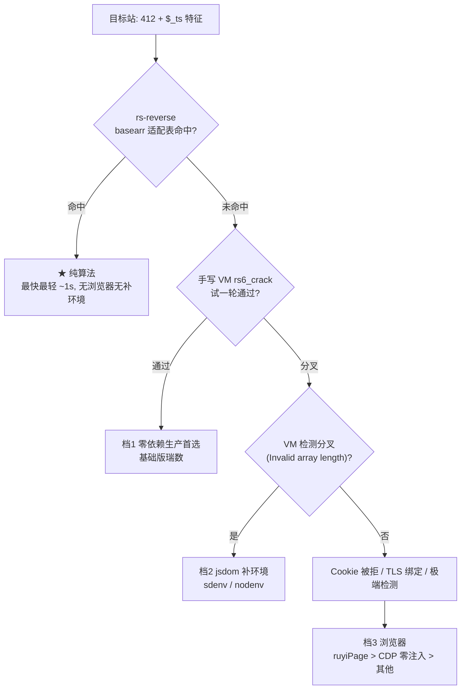
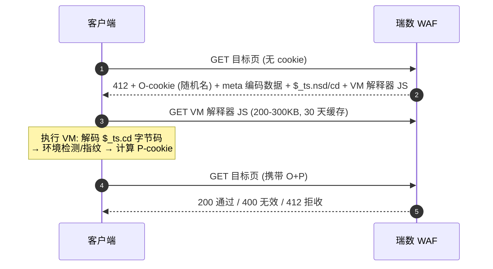

# 瑞数 WAF 逆向方案集 — 总索引

[](LICENSE)
[]()
[]()
[]()

**7 个真实瑞数站点 · 20+ 条技术路线 · 全部 200 通关**，覆盖纯算法 / 补环境 / 浏览器三大技术族。
每条路线都是「能请求到数据的最小可行代码」，含实测数据与避坑记录，可直接对照落地。

## 目录

- [站点案例](#站点案例)
- [路线 × 站点速查矩阵](#路线--站点速查矩阵)
- [快速启动](#快速启动)
- [三档方案决策表](#三档方案决策表)
- [选型决策流程](#选型决策流程)
- [关键认知](#关键认知)
- [常见问题](#常见问题)
- [License](#license)

## 站点案例

| 目录 | 站点 | 状态 | 可行方案 |
|------|------|------|---------|
| [site_e_enhanced](site_e_enhanced/)（站点E） | 中国信息通信研究院 | ✅ 活跃（2026-08-19 实测 200） | **jsdom 同步 flush**（421 chars 秒出）/ sdenv / CloakBrowser |
| [site_b_standard](site_b_standard/)（站点B） | 国家电网招聘网 | ✅ 活跃 | **rs-reverse 纯算法**（1.06s，200 验证） |
| [site_c_v67](site_c_v67/)（站点C） | 深圳大学总医院 | ✅ | sdenv / DrissionPage / CDP 零注入 / Camoufox |
| [site_a_base](site_a_base/)（站点A） | 5 所大学高校（逐一展示见下） | ✅ 2026-09-02 五校复测 | sdenv / **nodenv 零依赖手写补环境** / env_scu·env_njust 锁定模板 / CDP / ruyiPage / Camoufox / DrissionPage |
| [site_d_debugger](site_d_debugger/)（站点D） | 药监局 | ✅ | sdenv 链式 / CDP / rs-reverse 纯算法 / 手写补环境 v3 / 手写 harness / **RPC pajax 数据层**（0.2s/页） |
| [tax_ruishu](tax_ruishu/)（站点F） | 税务局（TLS 指纹双变体版） | ✅ | **rs-reverse 纯算法 len173 自制适配器**（7/7 轮 200，~1s）/ 手写补环境 v3（5/5）/ **sdenv jsdom**（2/2，~17s） |
| [patent_cnipa](patent_cnipa/)（站点G） | 专利局双站（检索 + 公布公告，同族 WAF） | ✅ 2026-09-01 三路线 200 | **sdenv 链式**（10-20s）/ **nodenv 零依赖手写补环境**（13.2-13.8s，9/9）/ **CDP RPC** 生产爬虫；另 2 条不可行路线归档（handpatch / rs-reverse）——完整路线全景见子目录 [README](patent_cnipa/README.md) |

> 目录使用代号（site_A~G）；真实站点映射与明文 URL 见 `sites_mapping.local.md`（本地维护，不入库）。仓库内 URL 一律 base64 编码存储，运行时解码。

### 站点A · 五所大学高校（逐一展示）

文件统一存放于 [site_a_base](site_a_base/)（技术类型分类整理），五校各自的成功路线如下：

| 高校 | 官网 (base64) | 成功技术路线（2026-09-02 复测） |
|------|--------------|-------------------------------|
| 兰州大学（985） | `aHR0cHM6Ly93d3cubHp1LmVkdS5jbg==` | **nodenv 零依赖手写补环境 5/5**（14.0-14.4s，P=335c）· sdenv 13-15s · CDP/ruyiPage |
| 四川大学（985） | `aHR0cHM6Ly93d3cuc2N1LmVkdS5jbg==` | **env_scu 锁定模板 3/3**（P=279c，runner 框架）· sdenv · CDP/ruyiPage |
| 北京邮电大学（211） | `aHR0cHM6Ly93d3cuYnVwdC5lZHUuY24=` | **nodenv 零依赖手写补环境 5/5**（13.4-13.6s，T=250c）· sdenv · CDP/ruyiPage |
| 南京师范大学（211） | `aHR0cHM6Ly93d3cubmpudS5lZHUuY24=` | **nodenv 零依赖手写补环境 5/5**（13.7-14.3s，T=250c）· sdenv · CDP/ruyiPage |
| 南京理工大学（211） | `aHR0cHM6Ly93d3cubmp1c3QuZWR1LmNu` | **env_njust 锁定模板 3/3**（P=173c，meta-embedded 特殊形态）· sdenv · CDP/ruyiPage |

> 解码：`echo <b64> | base64 -d`（bash）/ `[Convert]::FromBase64String("<b64>")`（PowerShell）。
> 五校中 lzu/bupt/njnu 已统一到 nodenv 零依赖方案；scu/njust 因形态差异保留独立锁定模板（详见 [site_a_base/README.md](site_a_base/README.md)）。

## 路线 × 站点速查矩阵

一眼看全「哪条路线在哪站跑通」——✅ 实测 200 · ⚡ 该站最快 · ❌ 已证不可行 · — 未实施：

| 路线 \ 站点 | A 高校组 | B 招聘 | C 医院 | D 药监 | E 研究院 | F 税务 | G 专利局 |
|---|---|---|---|---|---|---|---|
| **rs-reverse 纯算法** | ❌ | ✅ ⚡ 1.1s | — | ✅ ⚡ 1-4s | ❌ | ✅ ⚡ ~1s | ❌ |
| **sdenv / jsdom 补环境** | ✅ | ✅ | ✅ | ✅ | ✅ | ✅ | ✅ |
| **jsdom 同步 flush**（提速变体） | — | — | — | — | ✅ ⚡ 421c | — | — |
| **手写补环境**（零依赖） | ✅ 3/5 校 | — | ✅ 20/20 | ✅ 10/10 | ❌ | ✅ 5/5 | ✅ 9/9 |
| **CDP / RPC**（真实 Chrome） | ✅ | — | ✅ | ✅ ⚡ 0.2s RPC | — | — | ✅ RPC 生产 |
| **反检测浏览器**（ruyiPage 等） | ✅ | ✅ | ✅ | — | ✅ | — | — |

> 每格的具体文件、实测耗时与避坑，见上表站点链接的对应子目录 README。

## 快速启动

### 税务局（站点F，三路线）

```bash
cd tax_ruishu/

# ★ sdenv 补环境（jsdom，2026-08-19 新通）：curl_cffi 抓 412 → node 生成 P cookie → 验证 200
pip install curl_cffi && python spider_sdenv_tj.py --rounds=3

# 手写补环境（零 npm 依赖）：同上链路，Node v3 模板
python spider_manual_env.py

# 纯算法（最快 ~1s/次）：npm install rs-reverse && python patch_rs_reverse_tj.py
python spider_rs_pure.py
```

### 专利局双站（站点G）

```bash
cd patent_cnipa/
pip install curl_cffi

# 检索站 — sdenv 链式（npm sdenv）
python spider_sdenv.py

# 检索站 — nodenv 零依赖手写补环境（无需 npm install）
python spider_nodenv.py

# 公布公告站 — 生产爬虫（CDP RPC，免登录全量可爬）
cd epub && python rpc_spider.py 石墨烯 --max-pages 100
```

### 药监局（站点D）

```bash
cd site_d_debugger/
pip install curl_cffi websocket-client

# 数据采集首选 — RPC 直达 pajax（0.2s/页，签名免逆向）
python spider_rpc.py 阿莫西林 --max-pages 3

# 页面验证 — sdenv 链式（npm sdenv）或 CDP 零注入
python spider_sdenv_chain.py
```

## 三档方案决策表（核心知识）

| 档位 | 方案 | 依赖 | 速度 | 适用站点特征 | 已验证站点 |
|------|------|------|------|-------------|-----------|
| **1. 纯手写 VM** | rs6_crack.js（`--mode=full`） | **零依赖**（纯 Node 内置） | ~1.5s | 瑞数6基础版（无 eval 检测链/数组膨胀惩罚） | 甘肃发改（412→200 一次过） |
| **2. jsdom 补环境** | sdenv / jsdom_gen（同步 flush）/ round_gen（真实 timer）/ redirect-blocked | npm sdenv（Windows SDK 编译 canvas） | 2-14s（税务局 ~17s） | 瑞数6加强版（环境深层检测）——**环境是关键，timer 时序无关**（jsdom+同步flush 421 chars 实证） | 站点E / 高校1-5 / 深大总医院 / 药监局 / **税务局（2/2，escape 保留修复）** / **专利局检索站（9.9-20s）** |
| **2b. 零依赖手写补环境** | nodenv（vm.createContext + DONT_CONTEXTIFY + 键集对齐 + fakePTS） | **零依赖**（纯 Node 内置） | 13.2-13.8s | 同档2加强版——手写环境**可打通但工程量大**（8 处环境差异 + 宿主侧时间源 bug） | **专利局检索站（9/9，2026-09-01 打通）** / **大学站 3 校（15/15，2026-09-02 移植）** |
| **3. 浏览器** | CDP 零注入 / ruyiPage / CloakBrowser / RPC / DrissionPage / Camoufox | Chrome/Firefox | 1-18s | Cookie-TLS 强绑定 / IP 风控 / 极新 VM 形态 | 大学站 5/5（ruyiPage 2-3s/站最快）、深大总医院（CDP 3s） |
| **★ 纯算法** | rs-reverse（pysunday） | Node | ~1s | **basearr 适配器匹配的站点**（作者适配 + 自制适配器） | **国家电网招聘网（200 验证）、税务局（len173 自制适配器，7/7 轮 200）、药监局（len160 适配器 + 提升器 v7，10/10）** |

## 选型决策流程



瑞数挑战的通用四步（所有路线都在这条链上做文章）：



## 关键认知（三项目实战沉淀）

### 环境 vs timer（站点E 决定性实验）

| 方案 | 环境 | timer | 结果 |
|------|------|-------|------|
| sdenv 原版 | jsdom | 真实(等8s) | 343 chars ✅ |
| 纯手写环境 | 手写 | 同步 flush | Invalid array length ❌ |
| jsdom_hybrid | jsdom | **同步 flush** | **421 chars ✅ 秒出** |

**环境是关键，timer 时序无关**——同步 flush 不破坏 VM 状态机，sdenv 类方案可提速 5-10 倍。

### 手写补环境的边界（pro2/pro8/patent_cnipa 教训）

- 基础版瑞数（甘肃类）：手写 600 行环境即可过
- 加强版（站点E/高校1-5/深大总医院类）：VM 检测深层结构（eval direct 语义 / 函数 realm / DOM 集合类型）——手写**代价极大**，jsdom 是性价比底线
- **加强版手写可打通（专利局检索站实证，2026-09-01）**：nodenv 经 8 处环境差异修复
  （window/document 键集、navigator 形态、matchMedia 返回等）+ 宿主侧时间源 bug 修复后
  9/9 全 200。教训：**最后卡点往往不是 VM 环境本身，而是宿主侧逻辑**（cookie setter 用
  真实 Date.now 误删 VM fixdate 生成的 cookie）
- **浏览器层真实 > JS 层伪装**：对瑞数这类 VM 风控，真实 Chrome/Firefox 过挑战的可靠性远超补环境

### TLS 指纹双变体（税务局新发现，2026-08）

部分瑞数6站点按 **TLS 指纹（JA3）** 分发两套挑战 JS：浏览器（Chrome TLS）拿 174KB 友好版（1s 通关），Node/curl（OpenSSL TLS）拿 234KB 反机器版（`window['escape']` 门控死循环）。**变体与 UA 无关**（浏览器配 Firefox UA 仍拿友好版）。对策：纯算法路线不受变体影响（静态逆 VM 字节码 + 内层解密，见 tax_ruishu/）；补环境路线用 **curl_cffi（impersonate=chrome110）冒充 Chrome TLS 抓 412 拿友好版**，再喂手写 v3 模板执行（5/5 轮 200）或 **sdenv jsdom 执行**（2026-08-19 打通，2/2 轮 200，~17s/次；关键修复：**不能删 `window.escape`**——友好版 IIFE 的 opcode 178 分支依赖其 truthiness，反机器版时代的 `escape=undefined` 绕行残留会致 IIFE 早退无 P cookie，见 tax_ruishu/README.md 避坑 6）。2026-08-19 起服务器统一分发友好版（jj8pkMDMKUcA.43ade2a.js，无门控无自检），curl_cffi 抓到的即友好版。反机器版有两层 toString 自检：插桩即触发 `Invalid array length`（Node 侧）/空白页惩罚（浏览器侧）——只有透传钩子安全。

### 零注入原则（pro36 CDP 配方四要素）

1. 真实 chrome.exe + `--headless=new` + UA 对齐站点风控
2. **零 JS 注入**——任何 stealth 脚本改 navigator 属性描述符（值→getter）都会被 VM 检测
3. 导航用 renderer 跳转（`location.href=...`），不用 `Page.navigate`
4. Chrome 151+ 带 `--remote-allow-origins=*`，`--user-data-dir` 绝对路径

### 纯算法路线的现状（rs-reverse 深挖）

- 国家电网招聘网 ✅（适配器命中）；药监局 ✅（len160 自制适配器 + 提升器 v7 两处框架根因修复）；高校1 ❌（basearr 未适配 + tscd 对 2026 VM 失配）
- 内层密码系统已完全破解（真实内层 = AES 变体，非 Feistel 模型）
- 适配难点：rs-reverse 的 codemap 提取/任务树解码与 2026 VM 的 opcode 语义存在差异（方法调用 opcode 的 `_$lJ()` 步骤丢失）——药监局案例的解法 = ① len160 basearr 适配器 ② global_res 函数绑定优先（打破"cp2 数字表"假设）③ 函数声明预提升 v7（词法扫描，消除 `_$no is not a function` 类崩溃）
- 深挖资产：完整路线图与中间产物已归档（见 `site_d_debugger/纯算法攻克思路.md` 与 `tax_ruishu/README.md` 三节分析链路）

## 常见问题

- **站点返回空 404 + `wzws-ray` 头** → 多为 WAF 临时限流（491），等 30 分钟-数小时恢复（站点E 2026-08 误判为"换网神 WAF"，实测 08-19 仍瑞数 412 + 200）；持续数天再考虑换 WAF
- **P cookie 生成但 400/412** → 指纹一致性（HTTP UA == navigator.userAgent）；或 Cookie-TLS 绑定 → 档3
- **连续 3 轮失败** → IP 限流，等 1-3 小时或换代理
- **Clash 节点 IP 被标记**（高校4/高校5 偶发）→ 先切 Clash 节点

## License

[MIT](LICENSE) — 本仓库为逆向工程学习示例，仅供安全研究与教育用途。

⚠️ 免责声明：本仓库全部代码仅用于 WAF 机制学习与合规的数据采集研究，请遵守目标网站的服务条款与当地法律法规，勿用于任何未授权的自动化访问。
